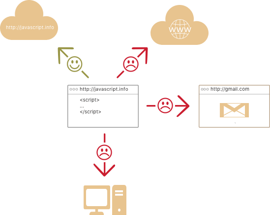

# Wprowadzenie do JavaScriptu

Zobaczmy co wyróżnia JavaScript, co można w nim osiągnąć i które technologie dobrze z nim współpracują.

## Co to jest JavaScript?

*JavaScript* był tworzony z myślą  *"ożywienia stron internetowych"*.

Programy w tym języku nazywane są *skryptami*. Mogą być pisane już w kodzie HTML strony i uruchamiane wraz z załadowaniem strony.

Skrypty są dostarczane i uruchamiane jako zwykły tekst. Nie potrzebują specjalnego przygotowania lub kompilacji do uruchomienia.

W tym aspekcie Javascript bardzo różni się od innego języka, jakim jest [Java](https://en.wikipedia.org/wiki/Java_(programming_language)).

```smart header="Dlaczego <u>Java</u>Script?"
Kiedy JavaScript był tworzony, początkowo miał inną nazwę: "LiveScript". Z powodu wysokiej popularności Javy, zdecydowano, że nazwanie języka tak jakby był "młodzym bratem" Javy pomoże.

Podczas ewolucji, JavaScript stał się w pełni niezależnym językiem z własną specyfikacją nazwaną [ECMAScript](http://en.wikipedia.org/wiki/ECMAScript), a aktualnie nie ma nic wspólnego z Javą.
```

Dzisiaj, JavaScript może być uruchamiany nie tylko w przeglądarkce, ale także na serwerze, lub nawet na dowolnym urządzeniu z specjalnym programem, [silnikiem JavaScript](https://en.wikipedia.org/wiki/JavaScript_engine).

Przeglądarki mają osadzony silnik, czasami nazywany "maszyną wirtualną JavaScriptu".

Różne silniki mają różne "nazwy kodowe". Na przykład:

- [V8](https://en.wikipedia.org/wiki/V8_(JavaScript_engine)) -- w Chromie i Operze.
- [SpiderMonkey](https://en.wikipedia.org/wiki/SpiderMonkey) -- w Firefoxie.
- ...Są też inne nazwy takie jak "Trident" i "Chakra" dla różnych wersji Internet Explorera, "ChakraCore" dla Microsoft Edge, "Nitro" i "SquirrelFish" dla Safari, itd.

Powyższe pojęcia warto zapamiętać, ponieważ są używane w artykułach deweloperów w internecie. Będziemy ich też używać. Dla przykładu, jeśli "funkcja X jest obsługiwana przez V8", to prawdopodobnie działa w Chromie i Operze.

```smart header="Jak działają silniki?"

Silniki są skomplikowane, ale podstawy są proste.

1. Silnik (osadzony jeśli jest to przeglądarka) czyta ("parsuje") skrypt.
2. Potem konwertuje ("kompiluje") skrypt na zrozumiały dla maszyny język.
3. Kod maszynowy jest wykonywany, i to całkiem szybko.

Silnik zapewnia optymalizacje na każdym etapie procesu. Widzi też jak wykonywany jest skrypt, analizuje wykorzystywane przezeń dane i aplikuje, bazujące na tej wiedzy, optymalizacje.
```

## Co może zrobić przeglądarkowy JavaScript?

Nowoczesny JavaScript jest "bezpiecznym" językiem programowania. Nie zapewnia niskopoziomowego dostępu do pamięci, czy procesora, dlatego że został początkowo stworzony dla przeglądarek, które tego nie wymagają.

Możliwości JavaScriptu ogromnie zależą od środowiska, w którym jest uruchamiany. Dla przykładu, [Node.JS](https://wikipedia.org/wiki/Node.js) wspiera funkcje, które pozwalają JavaScriptowi na odczytywanie/zapisywanie dowolnych plików, dokonywanie zapytań sieciowych, itd.

W przeglądarce JavaScript może zrobić wszystko związane z manipulacją stroną internetową, interakcją z użytkownikiem i serwerem.

Dla przykładu, w przeglądarce JavaScript może:

- Dodawać nowy kod HTML do strony, zmieniać istniejącą zawartość, modyfikować style.
- Reagować na akcje użytkownika, np. kliknięcia myszy, ruch kursora, wciskanie klawiszy.
- Wysyłać zapytania przez sieć do serwerów zdalnych, pobierać i wysyłać pliki (tak zwane [AJAX](https://en.wikipedia.org/wiki/Ajax_(programming)) i [COMET](https://en.wikipedia.org/wiki/Comet_(programming)).
- Wykorzystywać ciasteczka, zadawać pytania odwiedzającemu, pokazywać wiadomości.
- Zapisywać dane po stronie użytkownika ("lokalny magazyn danych").

## Czego nie może zrobić przeglądarkowy JavaScript?

JavaScriptowe możliwości w przeglądarce są ograniczone dla zachowania bezpieczeństwa użytkownika. Celem jest zapobiegnięcie korzystania z prywanych informacji lub uszkadzania danych użytkownika przez złe strony.

Przykłady takich ograniczeń to:

- JavaScript na stronie internetowej może nie móc operować na plikach na dysku twardym, kopiować ich lub uruchamiać programów. Nie ma bezpośredniego dostępu do funkcji systemu operacyjnego.

  Nowoczesne przeglądarki pozwalają mu pracować z plikami, ale z ograniczonym dostępem i tylko jeśli użytkownik wykona określoną akcję, taką jak "upuszczenie" pliku w oknie przeglądarki lub wybranie go przez znacznik `<input>`.

- Są sposoby interakcji z kamerą/mikrofonem i innymi urządzeniami, ale wymagają one udzielenia uprawnień prze użytkownika. Z tego powodu strony z włączonym JavaScriptem nie mogą potajemnie włączyć kamerki internetowej, obejrzeć otoczenie i wysłać informację do [NSA](https://en.wikipedia.org/wiki/National_Security_Agency).

- Różne zakładki/okna generalnie nie wiedzą o sobie. Czasami jednak tak jest, na przykład kiedy jedno okno używa JavaScriptu, żeby otworzyć inne. Ale nawet w takim przypadku, JavaScript z jednej strony nie może uzyskać dostępu do innej, jeśli pochodzą z innych witryn (innej domeny, protokołu lub portu).

  To nazywa się "Same Origin Policy". Do takiego działania, *obie strony* muszą zawierać specjalny kod JavaScriptu, który obsługuje wymianę danych.

  To ograniczenie jest, znowu, dla bezpieczeństwa użytkownika. Strona z `http://jakasstrona.com`, którą otworzył użytkownik, nie może uzyskać dostępu do innej karty przeglądarki ze stroną `http://gmail.com` i wykraść stąd informacji.

- JavaScript może łatwo komunikować się przez internet do serwera skąd pochodzi aktualna strona. Ale ta zdolność do uzyskiwania danych z innych stron/domen kuleje (nie zawsze działa prawidłowo). Znowu, jest to ograniczenie związane z bezpieczeństwem.



## Co sprawia, że JavaScript jest unikalny?

Są co najmniej *trzy* świetne rzeczy na temat JavaScriptu:

```
+ Pełna integracja z HTML/CSS
+ Proste rzeczy są proste do zrobienia
+ Wspiera wszystkie najważniejsze przeglądarki i jest domyślnie włączony.
```

JavaScript jest technologią możliwą do użycia tylko w przeglądarce, która łączy te trzy rzeczy.

To jest to co sprawia, że JavaScript jest unikalny. To dlatego jest najbardziej rozpowszechnionym narzędziem do tworzenia przeglądarkowych interfejsów.

Kiedy planuje się naukę nowej technologii, korzystnie jest sprawdzić jej perspektywy. Przejdźmy do nowoczesnych wpływających na to trendów, zawierających nowe języki i możliwości przeglądarek.

## Języki "ponad" JavaScript

Składnia JavaScriptu nie dla każdego się sprawdza. Różni ludzie chcą różnych funkcji.

To do przewidzenia, ponieważ projekty i wymagania są różne dla każdego.

Dlatego ostatnio pojawiło się mnóstwo nowych języków, które są konwertowane do JavaScriptu przed uruchomieniem w przeglądarce.

Nowoczesne narzędzia sprawiają, że konwertowanie jest bardzo szybkie i przejrzyste, pozwalając deweloperom do kodowania w innym języku, automatycznie konwertując go "po cichu".

Przykładu takich języków:

- [CoffeeScript](http://coffeescript.org/) jest "lukrem składniowym" dla JavaScriptu. Wprowadza krótszą składnię, pozwalając nam pisać przejrzystszy i bardziej precyzyjny kod. Zazwyczaj, deweloperzy Ruby to lubią.
- [TypeScript](http://www.typescriptlang.org/) jest skoncentrowany na dodaniu stałego typowania danych, aby uprościć rozwój i wsparcie dla skomplikowanych systemów. Jest tworzony przez Microsoft.
- [Dart](https://www.dartlang.org/) jest osobnym językiem, który ma własny silnik, działający poza przeglądarką (np. w aplikacjach mobilnych). Początkowo został zaoferowany przez Google jako zamiennik dla JavaScriptu, ale od teraz, przeglądarki wymagają konwertowania go do JavaScriptu, tak jak w powyższych przypadkach.

Jest ich więcej. Oczywiście, nawet jeśli używamy jednego z tamtych języków, powinniśmy również znać JavaScript, aby zrozumieć co tak naprawdę robimy.

## Podsumowanie

- JavaScript został początkowo stworzony jako język tylko przeglądarkowy, ale teraz jest także używany w wielu innych środowiskach.
- Dzisiaj, JavaScript ma unikalną pozycje, jako najszerzej rozpowszechniony przeglądarkowy język z pełną integracją z HTML/CSS.
- Jest wiele języków, które konwertowane są do JavaScriptu i dostarczają określonych funkcjonalności. Warto je przejrzeć, przynajmniej pobieżnie, po opanowaniu JavaScriptu.