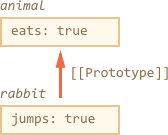
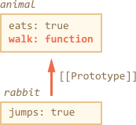
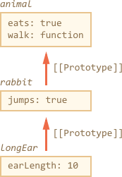
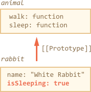

# Prototypal inheritance

In programming, we often want to take something and extend it.

For instance, we have a `user` object with its properties and methods, and want to make `admin` and `guest` as slightly modified variants of it. We'd like to reuse what we have in `user`, not copy/reimplement its methods, just build a new object on top of it.

*Prototypal inheritance* is a language feature that helps in that.

## [[Prototype]]

In JavaScript, objects have a special hidden property `[[Prototype]]` (as named in the specification), that is either `null` or references another object. That object is called "a prototype":


That `[[Prototype]]` has a "magical" meaning. When we want to read a property from `object`, and it's missing, JavaScript automatically takes it from the prototype. In programming, such thing is called "prototypal inheritance". Many cool language features and programming techniques are based on it.

The property `[[Prototype]]` is internal and hidden, but there are many ways to set it.

One of them is to use `__proto__`, like this:

```js run
let animal = {
  eats: true
};
let rabbit = {
  jumps: true
};

*!*
rabbit.__proto__ = animal;
*/!*
```

Please note that `__proto__` is *not the same* as `[[Prototype]]`. That's a getter/setter for it. We'll talk about other ways of setting it later, but for now `__proto__` will do just fine.

If we look for a property in `rabbit`, and it's missing, JavaScript automatically takes it from `animal`.

For instance:

```js run
let animal = {
  eats: true
};
let rabbit = {
  jumps: true
};

*!*
rabbit.__proto__ = animal; // (*)
*/!*

// we can find both properties in rabbit now:
*!*
alert( rabbit.eats ); // true (**)
*/!*
alert( rabbit.jumps ); // true
```

Here the line `(*)` sets `animal` to be a prototype of `rabbit`.

Then, when `alert` tries to read property `rabbit.eats` `(**)`, it's not in `rabbit`, so JavaScript follows the `[[Prototype]]` reference and finds it in `animal` (look from the bottom up):



Here we can say that "`animal` is the prototype of `rabbit`" or "`rabbit` prototypally inherits from `animal`".

So if `animal` has a lot of useful properties and methods, then they become automatically available in `rabbit`. Such properties are called "inherited".

If we have a method in `animal`, it can be called on `rabbit`:

```js run
let animal = {
  eats: true,
*!*
  walk() {
    alert("Animal walk");
  }
*/!*
};

let rabbit = {
  jumps: true,
  __proto__: animal
};

// walk is taken from the prototype
*!*
rabbit.walk(); // Animal walk
*/!*
```

The method is automatically taken from the prototype, like this:



The prototype chain can be longer:


```js run
let animal = {
  eats: true,
  walk() {
    alert("Animal walk");
  }
};

let rabbit = {
  jumps: true,
  __proto__: animal
};

let longEar = {
  earLength: 10,
  __proto__: rabbit
};

// walk is taken from the prototype chain
longEar.walk(); // Animal walk
alert(longEar.jumps); // true (from rabbit)
```



There are actually only two limitations:

1. The references can't go in circles. JavaScript will throw an error if we try to assign `__proto__` in a circle.
2. The value of `__proto__` can be either an object or `null`. All other values (like primitives) are ignored.

Also it may be obvious, but still: there can be only one `[[Prototype]]`. An object may not inherit from two others.

## Read/write rules

The prototype is only used for reading properties.

For data properties (not getters/setters) write/delete operations work directly with the object.

In the example below, we assign its own `walk` method to `rabbit`:

```js run
let animal = {
  eats: true,
  walk() {
    /* this method won't be used by rabbit */  
  }
};

let rabbit = {
  __proto__: animal
};

*!*
rabbit.walk = function() {
  alert("Rabbit! Bounce-bounce!");
};
*/!*

rabbit.walk(); // Rabbit! Bounce-bounce!
```

From now on, `rabbit.walk()` call finds the method immediately in the object and executes it, without using the prototype:


For getters/setters -- if we read/write a property, they are looked up in the prototype and invoked.

For instance, check out `admin.fullName` property in the code below:

```js run
let user = {
  name: "John",
  surname: "Smith",

  set fullName(value) {
    [this.name, this.surname] = value.split(" ");
  },

  get fullName() {
    return `${this.name} ${this.surname}`;
  }
};

let admin = {
  __proto__: user,
  isAdmin: true
};

alert(admin.fullName); // John Smith (*)

// setter triggers!
admin.fullName = "Alice Cooper"; // (**)
```

Here in the line `(*)` the property `admin.fullName` has a getter in the prototype `user`, so it is called. And in the line `(**)` the property has a setter in the prototype, so it is called.

## The value of "this"

An interesting question may arise in the example above: what's the value of `this` inside `set fullName(value)`? Where the properties `this.name` and `this.surname` are written: `user` or `admin`?

The answer is simple: `this` is not affected by prototypes at all.

**No matter where the method is found: in an object or its prototype. In a method call, `this` is always the object before the dot.**

So, the setter actually uses `admin` as `this`, not `user`.

That is actually a super-important thing, because we may have a big object with many methods and inherit from it. Then we can run its methods on inherited objects and they will modify the state of these objects, not the big one.

For instance, here `animal` represents a "method storage", and `rabbit` makes use of it.

The call `rabbit.sleep()` sets `this.isSleeping` on the `rabbit` object:

```js run
// animal has methods
let animal = {
  walk() {
    if (!this.isSleeping) {
      alert(`I walk`);
    }
  },
  sleep() {
    this.isSleeping = true;
  }
};

let rabbit = {
  name: "White Rabbit",
  __proto__: animal
};

// modifies rabbit.isSleeping
rabbit.sleep();

alert(rabbit.isSleeping); // true
alert(animal.isSleeping); // undefined (no such property in the prototype)
```

The resulting picture:



If we had other objects like `bird`, `snake` etc inheriting from `animal`, they would also gain access to methods of `animal`. But `this` in each method would be the corresponding object, evaluated at the call-time (before dot), not `animal`. So when we write data into `this`, it is stored into these objects.

As a result, methods are shared, but the object state is not.

## Summary

- In JavaScript, all objects have a hidden `[[Prototype]]` property that's either another object or `null`.
- We can use `obj.__proto__` to access it (there are other ways too, to be covered soon).
- The object referenced by `[[Prototype]]` is called a "prototype".
- If we want to read a property of `obj` or call a method, and it doesn't exist, then JavaScript tries to find it in the prototype. Write/delete operations work directly on the object, they don't use the prototype (unless the property is actually a setter).
- If we call `obj.method()`, and the `method` is taken from the prototype, `this` still references `obj`. So methods always work with the current object even if they are inherited.
